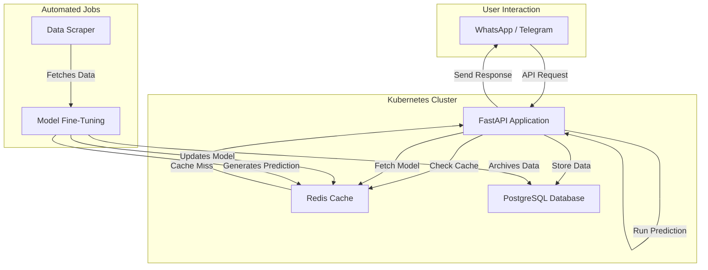

A sophisticated, cloud-native machine learning pipeline designed to fully automate the process of stock price prediction for equities from both the **NASDAQ** and **NEPSE** stock exchanges. Orchestrated by Kubernetes, its architecture is founded upon three distinct, containerized services that create a robust, end-to-end MLOps workflow.

The central component is a **FastAPI** application that serves as the brain of the operation, handling API requests and managing the entire machine learning lifecycle. This application is supported by **Redis**, which functions as a high-speed in-memory database for the critical tasks of caching final prediction values and the trained machine learning models themselves. Finally, a **PostgreSQL** database provides persistent, long-term storage for archiving the historical stock data gathered by the system's scrapers.

A fully automated, adaptive, and scalable system for real-time financial forecasting.

---

## System Architecture

The system is designed with a decoupled, microservices-based approach, making it scalable and resilient. All components are containerized and managed by Kubernetes.

---

### MLOps Pipeline
The entire workflow, from data acquisition to model deployment and prediction serving, is fully automated. Scheduled jobs handle data scraping and model retraining without any manual intervention.

### Continuous Model Fine-Tuning
The core of RetainAI is its ability to continuously learn. The system uses a **Long Short-Term Memory (LSTM)** neural network, an architecture well-suited for time-series forecasting. Instead of retraining from scratch, the system **fine-tunes** the existing model with newly scraped data. This ensures the models adapt to new market trends while retaining past knowledge. If a model doesn't exist for a stock, a new one is created and trained automatically.

### High-Performance Caching
To ensure low-latency responses, the system relies heavily on Redis.
- **Prediction Caching:** Final stock price predictions are cached for instantaneous retrieval.
- **Model Caching:** The serialized Keras models are stored in Redis, allowing the application to quickly load them for on-the-fly predictions in the event of a prediction cache miss.

### Stateless and Scalable Application
The main application is **stateless**, meaning it does not store any critical data on its own filesystem. All state is externalized to Redis and PostgreSQL. This design, combined with Kubernetes orchestration, allows the application to be easily scaled horizontally to handle increased load.

---

## Workflow

The system operates in a continuous, event-driven cycle:

1.  **Data Scraping:** A scheduled job periodically scrapes the latest closing prices for a predefined list of stocks from NASDAQ and NEPSE. The data is saved to temporary files.

2.  **Data Preprocessing:** The new data is scaled and transformed into sequences suitable for the LSTM model (a look-back period of 15 days is used to predict the next day).

3.  **Model Fine-Tuning:** The system loads the pre-trained Keras model for the specific stock and continues its training for a few more epochs using only the new data. The updated, more intelligent model is then saved.

4.  **Caching & Persistence:**
    - The newly fine-tuned model is cached in Redis.
    - A new prediction is generated and also cached in Redis.
    - The raw historical data is archived in the PostgreSQL database for long-term storage.

5.  **Cleanup:** The temporary data files are deleted to maintain a stateless application environment.

6.  **Prediction Serving:** When a user requests a forecast via WhatsApp or Telegram, the API first checks Redis for a cached prediction. If found, it's returned instantly. If not, the application retrieves the model from Redis, runs the prediction, caches the new result, and then responds to the user.

---

## License

This project is licensed under the MIT License. See the [LICENSE](LICENSE) file for details.

---